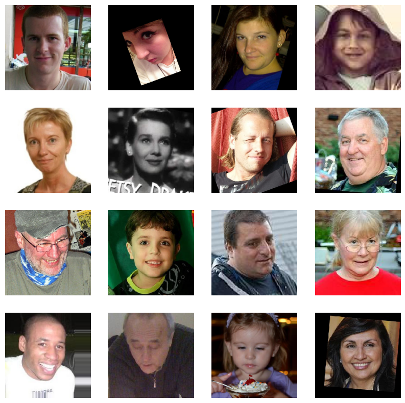

# -Image-Data-Generator-Computer-Vision-
Use ImageDataGenerator to create data.  Explore age distribution and print example photos.

🧠 Image Data Generator – Computer Vision Augmentation

This project demonstrates how to use Keras’ ImageDataGenerator to augment image datasets for deep learning in computer vision. Source file is [ChaLearn Looking at People - Dataset 26](https://chalearnlap.cvc.uab.es/dataset/26/description/)
 It visualizes real-time image transformations that help improve model generalization and reduce overfitting.

📚 Table of Contents
About the Project

Installation

Usage

Project Structure

Technologies Used

Results & Insights

Screenshots

Contributing

License

📌 About the Project
In this notebook, you'll learn how to:

Use ImageDataGenerator to augment training data

Apply rotation, zoom, width/height shift, flipping, and brightness changes

Visualize augmented images using matplotlib

Save generated batches of images for use in training convolutional neural networks (CNNs)

🛠 Installation
bash
Copy
Edit
pip install tensorflow matplotlib numpy jupyter
Then run the notebook with:

bash
Copy
Edit
jupyter notebook
🚀 Usage
Run the notebook Image Data Generator (Computer Vision).ipynb

Upload your own image or use the sample

Apply a variety of augmentations

Use the code as a base for preprocessing in your own CNN projects

📁 Project Structure
bash
Copy
Edit
## Image Data Generator (Computer Vision).ipynb   # Main notebook
images_imagegen/                                 # Screenshots of augmentations
README.md                                         # This file

⚙️ Technologies Used
Python 3.8+

Jupyter Notebook

TensorFlow / Keras

NumPy

Matplotlib

📊 Results & Insights
Visual augmentation helps simulate a broader dataset

Flip and zoom transformations improve model robustness

Great for training CNNs on limited or imbalanced datasets

📸 Screenshots
markdown
Copy
Edit
### 🖼️ Original vs Augmented Image Samples  

### 🔄 Batch of Augmented Images from Generator  

🤝 Contributing
Want to add additional transformations (e.g. CLAHE, blurring, color shifts)? Fork the project and submit a PR!

🪪 License
This project is licensed under the MIT License.

