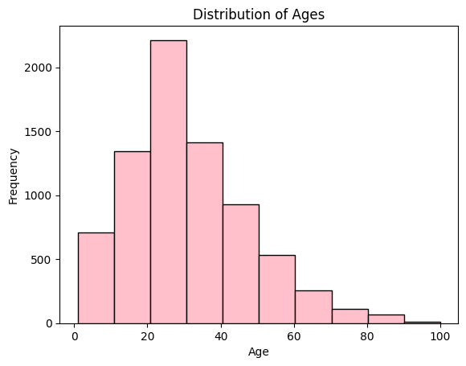

# -Image-Data-Generator-Computer-Vision-
Use ImageDataGenerator to create data.  Explore age distribution and print example photos.

🧠 Image Data Generator – Computer Vision Augmentation

This project demonstrates how to use Keras’ ImageDataGenerator to augment image datasets for deep learning in computer vision. Source file is [ChaLearn Looking at People - Dataset 26](https://chalearnlap.cvc.uab.es/dataset/26/description/)
 It visualizes real-time image transformations that help improve model generalization and reduce overfitting.

### 🧰 Techniques Demonstrated

| Category             | Technique                                          | Description / Example                                                                 |
|----------------------|----------------------------------------------------|----------------------------------------------------------------------------------------|
| **Computer Vision**   | `ImageDataGenerator` (Keras)                       | Augmented images with horizontal/vertical shifts, rotations, and rescaling for robustness. |
| **Neural Networks**   | ResNet50 + Custom Head                             | Used pretrained ResNet50 base with a custom regression head for age prediction.         |
| **CNN**               | Convolutional layers via ResNet                   | Leveraged deep CNNs for spatial feature extraction from facial images.                  |
| **Keras**             | Model API, Training, Callbacks                     | Implemented model architecture, fit/compile methods, and training loop using Keras.     |
| **TensorFlow**        | Backend engine                                     | Utilized TensorFlow GPU acceleration for training efficiency.                          |
| **Pipeline**          | End-to-end modeling flow                           | Data cleaning → augmentation → model training → evaluation pipeline.                    |
| **Visualization**     | EDA & Training Metrics                             | Age distribution histogram; plotted loss & MAE curves across epochs.                    |
| **Business Insight**  | Model Bias & Generalization                        | Identified imbalance in age distribution and its impact on model performance.           |
| **Overfitting Handling** | Dropout, GlobalAveragePooling2D, Augmentation  | Used architectural and data strategies to reduce overfitting.                           |

🧠 Predicting Age from Faces: A Deep Learning Journey with ResNet50
What if a machine could guess your age just by looking at your photo? That’s the question I set out to explore in this project using deep learning and computer vision.

🧹 It Started with Raw Data...
As with any good machine learning project, I began with Exploratory Data Analysis (EDA). I checked for duplicates, missing values, and nulls—ensuring the dataset was clean and ready for modeling. Then, I visualized the age distribution. Unsurprisingly, it wasn’t uniform. Some age groups dominated the sample, which hinted that the model might struggle with underrepresented ranges.

🧪 Teaching the Model to See
Next came the core of the project: preparing image data in a way that would help the model generalize. I used Keras’ ImageDataGenerator to preprocess and augment the dataset:

Rescaled pixel values to normalize input.

Enabled horizontal and vertical shifts to mimic real-world misalignments.

Allowed 90° rotations to improve robustness.

This meant the model wouldn’t just memorize what a “40-year-old” looks like in one pose—it would learn patterns across varied angles and lighting.

🏗️ Building on the Shoulders of Giants
Rather than training from scratch, I used ResNet50—a proven convolutional neural network—as a backbone. I stripped away the top layers and added:

A GlobalAveragePooling2D layer to reduce overfitting.

A Dense output layer tailored for regression.

The model was optimized using Adam, and trained on a GPU to take full advantage of parallelism.

📈 Progress… and Pitfalls

Over 20 epochs, the model’s training loss dropped dramatically:

From 95.35 to 17.02

Mean Absolute Error (MAE) improved from 7.43 to 3.18

This was a clear sign that the model was learning to make better predictions.

But the validation results told a more complicated story.
Initially, the validation loss decreased—but then it spiked at epoch 12 (185.63) and settled at 93.41 by the final epoch. It was a classic case of overfitting.

🧠 What I Learned

Training a model to estimate age from faces is as much about avoiding overconfidence as it is about accuracy. The training results were promising, but the validation behavior showed me that real-world generalization requires more than just data and compute—it demands restraint.

🔁 What’s Next

To improve generalization and performance:

Apply regularization techniques (dropout, L2)

Add early stopping to catch overfitting in action

Test alternative architectures like EfficientNet or MobileNet

Explore Grad-CAM to interpret what the model “sees” when it makes a prediction

This project wasn’t just about building a model—it was about understanding where it succeeds, where it struggles, and what that teaches us about deep learning in practice.

🛠 Installation
bash
Copy
Edit
pip install tensorflow matplotlib numpy jupyter
Then run the notebook with:

bash
Copy
Edit
jupyter notebook

🚀 Usage

Run the notebook Image Data Generator (Computer Vision).ipynb

Upload your own image or use the sample

Apply a variety of augmentations

Use the code as a base for preprocessing in your own CNN projects

📁 Project Structure

bash
Copy
Edit
## Image Data Generator (Computer Vision).ipynb   # Main notebook
images_imagegen/                                 # Screenshots of augmentations
README.md                                         # This file

⚙️ Technologies Used

Python 3.8+

Jupyter Notebook

TensorFlow / Keras

NumPy

Matplotlib

📸 Screenshots

### 🖼️ Original vs Augmented Image Samples  

### 🔄 Batch of Augmented Images from Generator  

🤝 Contributing
Want to add additional transformations (e.g. CLAHE, blurring, color shifts)? Fork the project and submit a PR!

🪪 License
This project is licensed under the MIT License.

